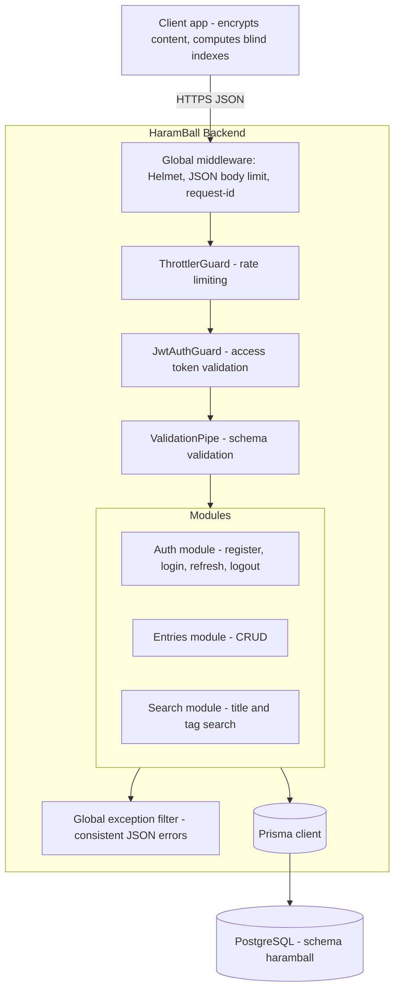
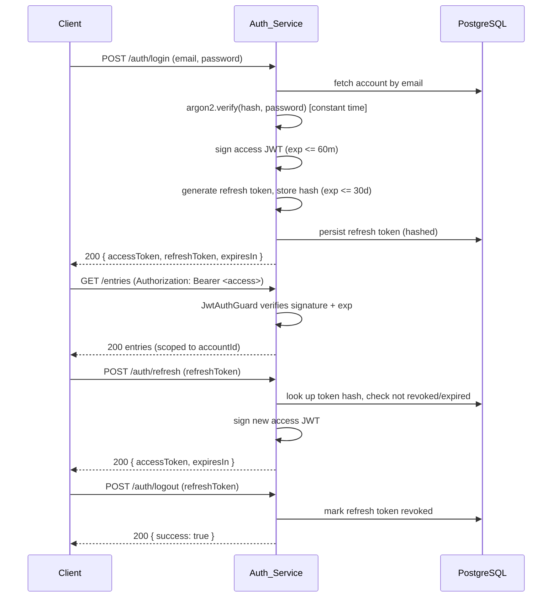
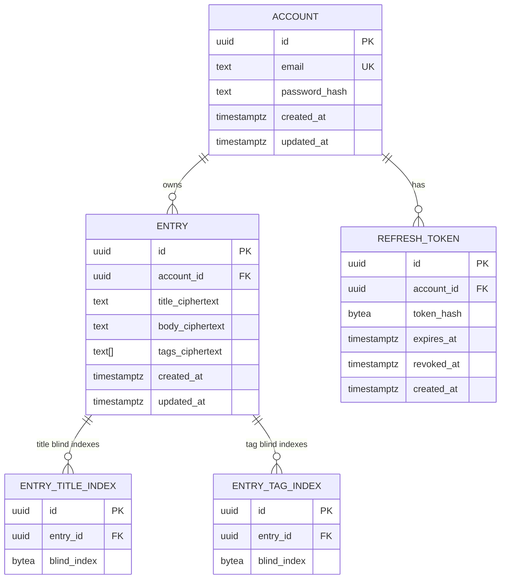

# Design Document

## Overview

This document describes the technical design of the **HaramBall backend** (`HaramBall-Back`), the server component of a personal password manager. The backend exposes a REST API for account management, authentication, and CRUD plus search over encrypted credential entries.

The defining constraint is a **zero-knowledge security model**: all entry content (title, body, tags) is encrypted on the client before transmission, the master password never reaches the server, and the server stores and returns ciphertext only. The server can neither decrypt entry content nor derive the keys that would allow it to.

Because the server cannot read plaintext titles or tags, search is implemented with **blind indexes** — deterministic, keyed HMAC values computed on the client and stored opaquely by the server. The server matches blind indexes by equality without ever seeing the underlying plaintext or the HMAC key.

### Goals

- Provide a secure, well-structured REST API for accounts, sessions, and entries.
- Preserve the zero-knowledge guarantee end-to-end on the server side.
- Enable title and tag search over encrypted data via blind indexes.
- Enforce strict per-owner data isolation.
- Load all secrets and connection details from the environment; commit no secrets.

### Non-Goals

- The client application (React Native + Expo) and all client-side cryptography (key derivation, encryption, blind-index computation) are out of scope.
- Server-side encryption, key escrow, or any capability to decrypt entry content is explicitly excluded by the zero-knowledge model.

### Key Design Decisions

| Decision | Choice | Rationale |
| --- | --- | --- |
| Framework | **NestJS (TypeScript)** | Opinionated modular architecture, first-class dependency injection, guards for JWT auth, interceptors/filters for consistent error handling, and `class-validator` integration. Encourages the layered, testable structure the project requires. |
| ORM / DB access | **Prisma** | Type-safe queries, declarative migrations, native `multiSchema` support for the `haramball` schema, and `Bytes`/`bytea` support for blind indexes. |
| Password hashing | **Argon2id** | Memory-hard, current OWASP recommendation; satisfies Requirement 1.2. |
| Tokens | **JWT access token + opaque random refresh token** | Stateless access tokens; refresh tokens persisted (hashed) so they can be revoked (Requirement 3.3). |
| Rate limiting | **`@nestjs/throttler` + a failed-attempt counter** | Covers both request-rate throttling (4.2) and the failed-auth threshold (4.1). |
| Search | **Blind index (keyed HMAC-SHA-256) computed client-side** | Enables equality/token matching over encrypted titles and tags without revealing plaintext or the key to the server. |

## Architecture

The backend follows a layered, modular architecture. NestJS modules group each functional area; within a module, requests flow Controller → Service → Repository (Prisma), with cross-cutting concerns handled by guards, pipes, interceptors, and filters.



### Request Lifecycle

1. **Global middleware** applies security headers (Helmet), enforces a JSON body-size limit (drives Requirement 5.5), and assigns a request id for log correlation.
2. **ThrottlerGuard** enforces request-rate limits (Requirement 4.2) before any handler runs.
3. **JwtAuthGuard** validates the access token on protected routes and attaches the authenticated `accountId` to the request (Requirements 3.4, 3.5, 15.1).
4. **ValidationPipe** validates and strips the request DTO against its schema (Requirement 15.2).
5. The **controller** delegates to a **service** that holds business logic; the service uses the **Prisma repository** for persistence.
6. A **global exception filter** converts any thrown error into the consistent JSON error envelope (Requirements 15.3, 15.4).

### Configuration and Startup

A configuration module validates environment variables at startup using a schema. If any required variable is missing, the application throws during bootstrap and exits with a message naming the missing variable (Requirement 13.3). No default secret values are baked in.

## Components and Interfaces

### Module Layout

- **ConfigModule** — loads and validates environment variables; exposes typed config.
- **PrismaModule** — provides the Prisma client and connection lifecycle.
- **AuthModule** — registration, login, refresh, logout; `Auth_Service`, `JwtAuthGuard`, token services, failed-attempt tracking.
- **EntriesModule** — create/read/update/delete entries; `Entry_Service`.
- **SearchModule** — title and tag search; `Search_Service`.
- **CommonModule** — global exception filter, response/error envelope, logging redaction, blind-index value validation helpers.

### Project / Folder Structure

```
HaramBall-Back/
├─ src/
│  ├─ main.ts                      # bootstrap: helmet, body limit, global pipes/filters
│  ├─ app.module.ts
│  ├─ config/
│  │  ├─ config.module.ts
│  │  ├─ env.schema.ts             # env var validation schema + names
│  │  └─ config.service.ts
│  ├─ common/
│  │  ├─ filters/all-exceptions.filter.ts
│  │  ├─ interceptors/logging.interceptor.ts   # redaction-aware logging
│  │  ├─ errors/app-error.ts       # error codes + AppError class
│  │  ├─ dto/pagination.dto.ts
│  │  └─ validators/blind-index.validator.ts
│  ├─ prisma/
│  │  ├─ prisma.module.ts
│  │  └─ prisma.service.ts
│  ├─ auth/
│  │  ├─ auth.module.ts
│  │  ├─ auth.controller.ts
│  │  ├─ auth.service.ts
│  │  ├─ token.service.ts          # access (JWT) + refresh token issue/verify/revoke
│  │  ├─ password.service.ts       # argon2 hash/verify
│  │  ├─ failed-attempts.service.ts
│  │  ├─ guards/jwt-auth.guard.ts
│  │  ├─ strategies/jwt.strategy.ts
│  │  └─ dto/{register,login,refresh,logout}.dto.ts
│  ├─ entries/
│  │  ├─ entries.module.ts
│  │  ├─ entries.controller.ts
│  │  ├─ entries.service.ts
│  │  └─ dto/{create-entry,update-entry}.dto.ts
│  ├─ search/
│  │  ├─ search.module.ts
│  │  ├─ search.controller.ts
│  │  ├─ search.service.ts
│  │  └─ dto/{title-search,tag-search}.dto.ts
│  └─ crypto/
│     └─ blind-index.ts            # server-side normalization checks (NOT key holding)
├─ prisma/
│  ├─ schema.prisma
│  └─ migrations/
├─ test/                           # e2e + property tests
├─ .env.example
├─ .gitignore                      # includes .env
├─ package.json
└─ README.md
```

### REST API

All routes are prefixed `/api/v1`. Entry and search routes require a valid access token (Requirement 15.1). All responses are JSON (Requirement 15.4).

#### Auth endpoints

| Method | Path | Auth | Description | Success |
| --- | --- | --- | --- | --- |
| POST | `/auth/register` | none | Register an account | 201 |
| POST | `/auth/login` | none | Authenticate, issue tokens | 200 |
| POST | `/auth/refresh` | refresh token | Issue a new access token | 200 |
| POST | `/auth/logout` | refresh token | Revoke a refresh token | 200 |

Request/response shapes:

- `POST /auth/register` — body `{ "email": string, "password": string }` → `201 { "id": uuid, "email": string }`. Errors: 409 (email exists), 400 (invalid email / password < 12 chars).
- `POST /auth/login` — body `{ "email": string, "password": string }` → `200 { "accessToken": string, "refreshToken": string, "expiresIn": number }`. Errors: 401 (generic), 429 (too many failed attempts).
- `POST /auth/refresh` — body `{ "refreshToken": string }` → `200 { "accessToken": string, "expiresIn": number }`. Errors: 401.
- `POST /auth/logout` — body `{ "refreshToken": string }` → `200 { "success": true }`.

#### Entry endpoints

| Method | Path | Auth | Description | Success |
| --- | --- | --- | --- | --- |
| POST | `/entries` | access | Create an entry | 201 |
| GET | `/entries` | access | List the caller's entries | 200 |
| GET | `/entries/:id` | access | Get one entry | 200 |
| PUT | `/entries/:id` | access | Replace entry fields | 200 |
| DELETE | `/entries/:id` | access | Delete an entry | 204 |

Create/update request body (all content fields are opaque ciphertext strings produced by the client):

```json
{
  "titleCiphertext": "base64...",
  "bodyCiphertext": "base64...",
  "tagsCiphertext": ["base64...", "base64..."],
  "titleBlindIndexes": ["hex-hmac...", "hex-hmac..."],
  "tagBlindIndexes": ["hex-hmac...", "hex-hmac..."]
}
```

- `titleBlindIndexes` is the set of blind-index values the client wants searchable for this title (e.g., full normalized title plus token/prefix blind indexes — see Search Mechanism).
- `tagBlindIndexes` is one blind index per tag.
- Entry responses return ciphertext fields, `id`, `createdAt`, `updatedAt`. Blind indexes are **not** returned (they are inputs, not display data).

#### Search endpoints

| Method | Path | Auth | Description | Success |
| --- | --- | --- | --- | --- |
| POST | `/search/title` | access | Find entries by title blind index | 200 |
| POST | `/search/tags` | access | Find entries by tag blind index(es) | 200 |

- `POST /search/title` — body `{ "titleBlindIndex": "hex-hmac..." }` → `200 { "entries": [ { id, titleCiphertext, bodyCiphertext, tagsCiphertext, createdAt, updatedAt } ] }`.
- `POST /search/tags` — body `{ "tagBlindIndexes": ["hex-hmac..."], "match": "any" | "all" }` → `200 { "entries": [...] }`. Empty matches return `{ "entries": [] }` with 200.

Search is a POST (not GET) so blind-index values travel in the body rather than in URLs/query strings or server access logs, reducing incidental leakage (supports Requirement 12.4).

### Blind-Index Search Mechanism

This is the core design decision enabling search over encrypted data.

#### How a blind index works

A blind index is a deterministic keyed hash of a normalized plaintext value:

```
blindIndex = HMAC-SHA256(indexKey, normalize(plaintext))
```

- `indexKey` is derived **on the client** from the master password (e.g., via a KDF) and is **never sent to the server**.
- `normalize` is a client-side canonicalization (Unicode NFKC, trim, lowercase) so that equivalent inputs produce the same index.
- The server stores the resulting value as opaque bytes and matches it by **equality only**. Without the key, the server cannot compute or reverse the index, so it learns no plaintext.

Because HMAC is deterministic, two entries with the same normalized title/tag produce the same blind index, which is exactly what enables equality search. The cost is **equality/frequency leakage**: the server can observe that two entries share a title or tag, and the access pattern of searches. This is an accepted trade-off documented below.

#### Title search: exact vs. chat-style partial matching

A single full-title HMAC supports only exact-title matching. To support the chat-style "type the name" search, the client computes **multiple blind indexes per title**:

- One for the full normalized title (exact match).
- One per **prefix token** — for a title normalized to tokens, the client emits blind indexes for leading prefixes of each token (e.g., for "github", prefixes `gi`, `git`, `gith`, ... down to a configured minimum length).

The server stores each of these in a one-to-many `entry_title_index` table. A title search sends the blind index of whatever the user typed; the server returns entries that have a matching stored blind index. The matching logic on the server is pure equality and is identical regardless of whether the index represents a full title or a prefix.

**Trade-offs of the prefix approach:**

- *Leakage*: more stored indexes reveal title length/token-count distribution and shared prefixes across entries. Mitigation: enforce a minimum prefix length and cap the number of indexes per entry.
- *Storage*: O(title length) indexes per entry. Mitigation: cap and dedupe client-side.
- *Alternative considered*: server-side trigram/`pg_trgm` search — rejected because it requires plaintext, violating the zero-knowledge model.

The server design is agnostic to the exact tokenization the client chooses: the contract is simply "store these opaque blind indexes; match incoming queries by equality, scoped to the owner." This keeps all cryptographic policy on the client per the zero-knowledge model.

#### Tag search

Each tag yields one blind index, stored in `entry_tag_index`. A tag query sends one or more tag blind indexes; with `match=any` the server returns entries having at least one matching tag index, with `match=all` it returns entries having all of them. All matching is equality, scoped to the owner.

### Authentication / JWT Flow



- **Access token**: JWT signed (HS256) with `JWT_ACCESS_SECRET`; claims include `sub` (accountId) and `exp` ≤ 60 minutes (Requirements 2.5, 2.6).
- **Refresh token**: a high-entropy random string returned to the client; only its hash is persisted, with `expiresAt` ≤ 30 days and a `revokedAt` column (Requirements 3.3, 3.6). Verification hashes the presented token and looks it up; revoked/expired/unknown tokens are rejected with 401 (Requirement 3.2).
- **Failed-attempt lockout**: a per-client-identifier counter (keyed by email and/or source IP) increments on auth failure; when failures exceed 10 within a rolling 15-minute window, login is rejected with 429 (Requirement 4.1). Thresholds and window come from the environment (Requirement 4.3).

### Validation Strategy

- DTOs use `class-validator` decorators; a global `ValidationPipe` runs with `whitelist: true` (strips unknown properties) and `forbidNonWhitelisted: false`.
- Validation failures produce 400 with a body listing the invalid fields (Requirement 15.2).
- Field rules: email format (Requirement 1.5), password min length 12 (Requirement 1.6), required `titleCiphertext` (Requirement 5.4), blind-index values constrained to a hex/base64 charset and bounded length, `tagsCiphertext`/index arrays bounded in count.
- A JSON body-size limit enforces the maximum entry size; oversize requests yield 413 (Requirement 5.5).

## Data Models

The database uses a single PostgreSQL schema named `haramball` (Requirement 14.1). All identifiers are UUIDs (Requirement 14.2). Referential integrity and cascading deletes are enforced at the database level (Requirements 14.3, 14.4).



### Tables

**`haramball.accounts`**
- `id` UUID PK (default generated).
- `email` TEXT, unique, not null (Requirement 1.4 uniqueness).
- `password_hash` TEXT not null — Argon2id hash only; plaintext is never stored (Requirements 1.3, 2.2).
- `created_at`, `updated_at` TIMESTAMPTZ not null.

**`haramball.entries`**
- `id` UUID PK.
- `account_id` UUID FK → `accounts.id` `ON DELETE CASCADE` (Requirements 14.3, 14.4).
- `title_ciphertext` TEXT not null — opaque ciphertext (Requirements 5.2, 12.1).
- `body_ciphertext` TEXT — opaque ciphertext.
- `tags_ciphertext` TEXT[] — array of opaque ciphertext tag values.
- `created_at`, `updated_at` TIMESTAMPTZ not null (Requirements 5.3, 7.2).
- Index on `account_id` for owner-scoped listing.

**`haramball.entry_title_index`**
- `id` UUID PK.
- `entry_id` UUID FK → `entries.id` `ON DELETE CASCADE` (Requirements 8.1).
- `blind_index` BYTEA not null — opaque keyed-HMAC value (Requirement 9.5).
- Composite index on `(entry_id)` and on `(blind_index)` to support equality search; search queries always join through `entries.account_id` to scope by owner (Requirement 9.4).

**`haramball.entry_tag_index`**
- `id` UUID PK.
- `entry_id` UUID FK → `entries.id` `ON DELETE CASCADE`.
- `blind_index` BYTEA not null — one per tag (Requirement 10.5).
- Index on `(blind_index)`; search joins through `entries.account_id` for owner scoping (Requirement 10.4).

**`haramball.refresh_tokens`**
- `id` UUID PK.
- `account_id` UUID FK → `accounts.id` `ON DELETE CASCADE`.
- `token_hash` BYTEA not null — hash of the refresh token; raw token never stored.
- `expires_at` TIMESTAMPTZ not null (≤ 30 days, Requirement 3.6).
- `revoked_at` TIMESTAMPTZ nullable — set on logout (Requirement 3.3).
- `created_at` TIMESTAMPTZ not null.

### Data-handling rules

- Ciphertext fields are written and read verbatim; the server never decrypts, parses, or transforms them (Requirements 5.2, 6.5, 7.3).
- The master password and any decryption key are never accepted, logged, or persisted; there is no column or DTO field for them (Requirements 12.2, 12.3).
- Logs redact ciphertext, password values, and blind-index inputs (Requirement 12.4).

### Environment Variables (`.env.example`)

| Variable | Purpose |
| --- | --- |
| `DATABASE_URL` | PostgreSQL connection string (Requirement 13.1) |
| `DATABASE_SCHEMA` | `haramball` |
| `JWT_ACCESS_SECRET` | Access-token signing secret (Requirement 13.2) |
| `JWT_ACCESS_TTL` | Access-token lifetime (≤ 60m) |
| `REFRESH_TOKEN_TTL` | Refresh-token lifetime (≤ 30d) |
| `AUTH_MAX_FAILED_ATTEMPTS` | Failed-attempt threshold (default 10) |
| `AUTH_FAILED_WINDOW` | Failed-attempt window (default 15m) |
| `RATE_LIMIT_MAX` / `RATE_LIMIT_WINDOW` | Request-rate throttle config |
| `MAX_ENTRY_BYTES` | Maximum entry/body size for 413 enforcement |
| `PORT` | HTTP listen port |

`.env` is listed in `.gitignore` (Requirement 13.4); `.env.example` documents names without real values (Requirement 13.5).
